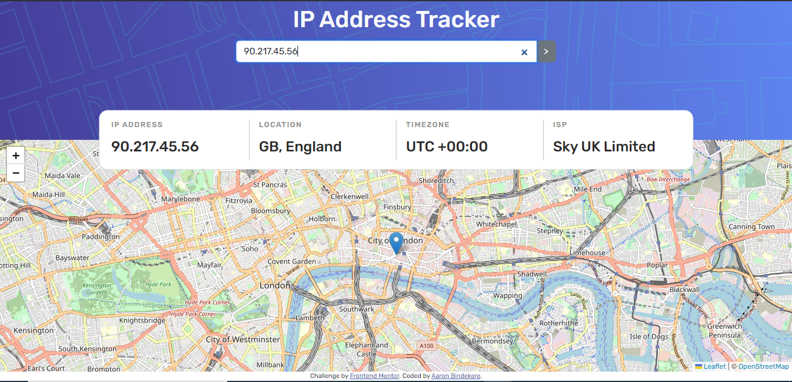

# Frontend Mentor - IP address tracker solution

This is a solution to the intermediate [IP address tracker challenge on Frontend Mentor](https://www.frontendmentor.io/challenges/ip-address-tracker-I8-0yYAH0) that requires participants to create an IP Address Tracker from scratch.

## Table of contents

- [Overview](#overview)
  - [The challenge](#the-challenge)
  - [Screenshot](#screenshot)
  - [Links](#links)
- [My process](#my-process)
  - [Built with](#built-with)
  - [Useful resources](#useful-resources)
- [Author](#author)
- [Acknowledgments](#acknowledgments)

## Overview

This challenge was a great opportunity to test and improve my API data fetching and processing skills, working with external libraries and intergrating bootstrap. The layout was fairly easy to implement. It was also good practice for other frontend skills such as responsive layouts, flexbox, bootsrap customizing, IP Addresses,HTML, CSS e.t.c

### The challenge

Users should be able to:

- View the optimal layout for each page depending on their device's screen size.✔️
- See hover states for all interactive elements on the page.✔️
- See their own IP address on the map on the initial page load.✔️
- Search for any IP addresses or domains and see the key information and location.✔️

### Screenshot

A screenshot of the final look of the IP Address Tracker.

### Links

- Solution URL: [Add solution URL here](https://your-solution-url.com)
- Live Site URL: [IP Address Tracker](https://bindekere-ip-address-tracker.netlify.app/)

## My process

I was fascinated by this challenge on frontend mentor mainly because it's map implementation which made it standout.
Not many projects require intergrating maps in the layout so this to me was unique and that meant it would be challenging to me (indeed it was).
I also saw it as an opportunity to learn a new concept and to work with a new library i.e Leaflet.js apart from the common libraries like react.
With this in mind I deliberately tackled this challenge with fairly new technologies (to me at the time) and it involved alot of learning.

I started by learning bootstrap (mainly bootstrap customization with css) and then with the help of the bootstrap grid I built the layout of the web app.
I also learnt leaflet.js and practiced error handling in API calls and applied it in the programming process.

### Built with

- Semantic HTML5 markup
- CSS
- Bootstrap
- Javascript
- Mobile-first workflow
- [Leaflet.js](https://leafletjs.com/index.html) - JS library for map intergration
- [OpenStreetMap.org](https://nextjs.org/) - displaying maps
- [ipify.org](https://www.ipify.org/) - API to work with IP addresses

If you want more help with Frontend development, I'd recommend checking out [Scrimba](https://scrimba.com/allcourses) to learn more.

### Useful resources

- [The Net Ninja](https://www.youtube.com/watch?v=O_9u1P5YjVc&list=PL4cUxeGkcC9joIM91nLzd_qaH_AimmdAR) - This is the resource I used to learn bootstrap. It is a short but precise course. Do not forget to code along with the tutorials instead of just watching.
- [Bootstrap Docs](https://getbootstrap.com/) - The bootstrap docs is probably the best resource for learning Bootstrap as it is conscise and well explained. It also contains pre-built bootstrap components.

## Author

- Website - [Aaron Bindekere Lutalo](https://github.com/Bindekere)
- Frontend Mentor - [@Bindekere](https://www.frontendmentor.io/profile/Bindekere)
- Instagram - [@lutalo\_](https://www.instagram.com/_lutalo_/)

## Acknowledgments

-Water 😂
-Spotify
